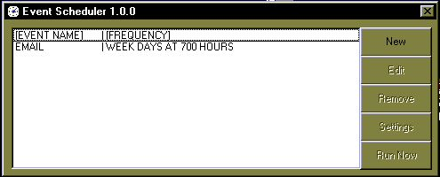



## Event Scheduler

### Description

Application scheduled running. To run any application at a given hour on a given date, once a month, once a week, or once a day without having to have user input.
 
### More Info
 
None code-wise.

Windows API knowledge is preferable. Must know VB fluently, however, abundant comments are throught-out the code. References to AutoBot, whom wrote the SysTray module, are included for his work. All other code is my original work.

             |
---                |---
**Submitted On**   |2002-07-16 16:20:06
**By**             |[Daniel K Murphy](https://github.com/Planet-Source-Code/PSCIndex/blob/master/ByAuthor/daniel-k-murphy.md)
**Level**          |Advanced
**User Rating**    |5.0 (10 globes from 2 users)
**Compatibility**  |VB 6\.0
**Category**       |[Complete Applications](https://github.com/Planet-Source-Code/PSCIndex/blob/master/ByCategory/complete-applications__1-27.md)
**World**          |[Visual Basic](https://github.com/Planet-Source-Code/PSCIndex/blob/master/ByWorld/visual-basic.md)
**Archive File**   |[Event\_Sche1072067172002\.zip](https://github.com/Planet-Source-Code/daniel-k-murphy-event-scheduler__1-36991/archive/master.zip)

### API Declarations

See the code.

